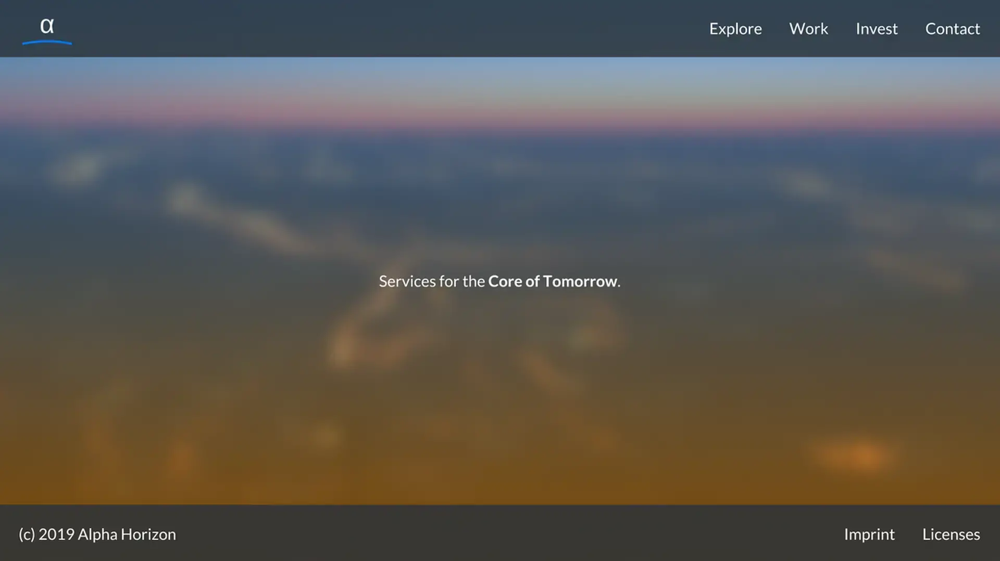

# Categorical Thinking

## 🌏 Individual: Felicitas Pojtinger


Minimalist dev that loves JS and the web. Also known as `pojntfx`.

- [Site](https://felicitas.pojtinger.com)
- [Nextcloud](https://nextcloud.com/pojntfx)
- [GitHub](https://github.com/pojntfx)
- [Instagram](https://github.com/pojntfx)
- [Twitter](https://twitter.com/@pojntfx)
- [GitLab](https://gitlab.com/pojntfx)
- [NPM](https://npmjs.com/~pojntfx)
- [dev.to](https://dev.to/pojntfx)
- ...

```yaml
Site:
  Landing: Gatsby
  Projects: Gatsby
  Articles: Gatsby
Description: Things that need services (i.e. accounting)
Work:
  Browsers:
    - Laptop (ThinkPad X1 Carbon)
    - Phone (Nexus 4)
    - Tablet (Venue 8 Pro)
    - Library (Kindle Paperwhite)
  Life Support:
    - Water and Coffee
    - Snacks
  Input:
    - Mouse
    - Mouse pad
  Internet:
    - WWAN
    - WLAN
    - LAN
  Power:
    - USB-C and TB3 chargers
    - USB-C and TB3 dock
    - Cord
  Sound:
    - Headphones
    - Integrateds
  Media:
    - USB sticks
    - LAN cables
  Cluster:
    - Microcomputer (Raspberry Pis)
    - Switch
  Documents:
    - Passport
    - Drivers license
    - Legal
    - Bills
  Money:
    - Online (PayPal)
    - Cash (Volksbank)
    - Bag (wallet)
  Tools: Pencil case
  Paper:
    - Notepad
    - Notebook
  Services:
    - Many
Indoor Clothing:
  Shirts: Short and long sleeves
  Sweaters: With and without hoods
  Pants: Blue, black and grey
  Underpants: Black and white
  Swimming Trunks: For bathing
  Socks: Black and white
Outdoor Clothing:
  Suit: Black and white
  Shoes: Winter and summer
  Jacket: Formal and informal
  Gloves: Leather
  Scarf: Black and grey
Hygiene:
  Washbag: All articles
  Towel: Small and big
  Sun Protection:
    - Eyes
    - Skin
  Backpack: Fits everything
Sleep:
  Bed:
    - Futon
    - Sheets
  Sleeping Bag: For travels
```

## 🌐 Foundation: Standard Framework


The Futurist's Approach to System Design. It's handle is `standardframework` which may be abbreviated as `SDFW`.

- [Site](https://standardframework.io)
- [Code](https://code.standardframework.io)
- [Chat](https://chat.standardframework.io)
- [Forum](https://forum.standardframework.io)

```yaml
Site:
  Landing: Gatsby
  Docs: Gatsby
  Blog: Gatsby
Code:
  Libraries: GitLab
  Services: GitLab
  Gateway: GitLab
  Web Client: GitLab
  Terminal Client: GitLab
  Drivers: GitLab
Chat: RocketChat
Forum: Discourse
```

## 🏭 Corporation: Alpha Horizon




The Core of Tomorrow. It's handle is `alphahorizonio` which may be abbreviated as `AHZN`.

- [Site](https://alphahorizon.io)
- [Company](https://company.alphahorizon.io)
- [Collaboration](https://collaboration.alphahorizon.io)

```yaml
Site:
  Landing: Gatsby
  Explore: Gatsby
  Work: Gatsby
  Invest: Gatsby
  Contact: Gatsby
Company:
  Customers: ERPNext
  Employees: ERPNext
  Resources: ERPNext
  Factory: ERPNext
  Strategy: ERPNext
  Operations:
    Identity: Standard Framework
    Workflow: Standard Framework
    Workspace: Standard Framework
    Activity: Standard Framework
    Configuration: Standard Framework
    Dashboard: Standard Framework
    Infrastructure: Standard Framework
    Metrics: Standard Framework
    Demos: Standard Framework
    Editor: VSCodium
    Terminal: Terminal
    Debugging: Standard Framework
    Tracer: Standard Framework
    Shell: Standard Framework
Cloud:
  Edge: Standard Framework
  Host:
    Compute: Standard Framework
    Communications: Standard Framework
    Propulsion: Standard Framework
    Rotation: Standard Framework
    Navigation: Standard Framework
    Energy: Standard Framework
  Node: Runtime (Standard Framework)
  Media: Standard Framework
  Provisioner: Standard Framework
  Undercloud:
    Compute: Standard Framework
    Storages: Standard Framework
    Domains: Standard Framework
    Routes: Standard Framework
  Overcloud:
    Ingress: Standard Framework
    Deployments: Standard Framework
    Services: Standard Framework
    Volumes: Standard Framework
  Center: Standard Framework
  Station: Standard Framework
Collaboration:
  - Standard Framework
  - Nextcloud
  - Collabora
```
