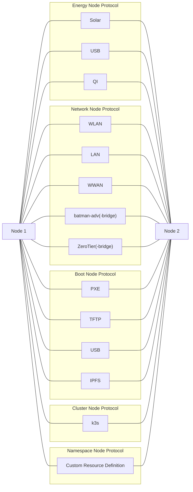

# Cluster Platform Diagram Overview

> This is the hyper-imperative version that gives you as much control as possible. Feel free to implement your own architecture.

## States

```mermaid
graph TB
    subgraph node 1 in state 9 instance of service mesh node
        subgraph additions of step 8
            service_1[service 1]
            service_2[service 2]
            service_n["... service(s) n"]
        end
        subgraph node 1 in state 8 instance of service mesh namespace node
            subgraph additions of step 7
                nats[NATS]
                minio[MinIO]
                verdaccio[Verdaccio]
                dependency_n[... dependency/ies n]
            end
            subgraph node 1 in state 7 instance of layer n cluster node
                subgraph additions of step 6
                    kubernetes_master_components_n[Kubernetes master components in layer n]
                    kubernetes_node_components_n[Kubernetes node components in layer n]
                    nested_stage_6[... n * stage 6]
                    kubevirt[KubeVirt]
                end
                subgraph node 1 in state 6 instance of layer 1 cluster node
                    subgraph additions of step 5
                        kubernetes_master_components_1[Kubernetes master components in layer 1]
                        kubernetes_node_components_1[Kubernetes node components in layer 1]
                        containerd
                        kube_router[Kube-router]
                        rook
                        k3s
                    end
                    subgraph node 1 in state 5 instance of global network node
                        subgraph additions of step 4
                            zerotier[ZeroTier]
                        end
                        subgraph node 1 in state 4 instance of local network node
                            subgraph additions of step 3
                                network_manager[NetworkManager]
                                wpa_supplicant
                                sw_update[SWUpdate]
                                dropbear[Dropbear]
                                busybox[BusyBox]
                                ca_certificates[ca-certificates]
                                systemd
                                linux_selinux[Linux and SELinux]
                            end
                            subgraph node 1 in state 3 instance of iPXE node
                                subgraph additions of step 2
                                    ipxe[iPXE]
                                end
                                subgraph node 1 in state 2 instance of UEFI/BIOS node
                                    subgraph additions of step 1
                                        uefi_bios[UEFI/BIOS]
                                    end
                                    subgraph node 1 in state 1 instance of proprietary node
                                        subgraph additions of step 0
                                            proprietary_uefi_bios_bootloader[proprietary UEFI/proprietary BIOS/proprietary bootloader]
                                            usb[USB]
                                            network[network]
                                            energy[energy]
                                        end
                                        subgraph node 1 in state 0 instance of host
                                            subgraph before additions of step 0
                                                usbprovider[USB provider]
                                                pwrprovider[energy provider]
                                                netprovider[network provider]
                                            end
                                        end
                                    end
                                end
                            end
                        end
                    end
                end
            end
        end
    end
    service_1 --- nats
    service_2 --- nats
    service_n --- nats
    service_1 --- verdaccio
    service_2 --- verdaccio
    service_n --- verdaccio
    service_2 --- dependency_n
    service_n --- dependency_n
    service_n --- minio
    nats --- kubernetes_master_components_n
    minio --- kubernetes_master_components_n
    verdaccio --- kubernetes_master_components_n
    kubernetes_master_components_n --- kubernetes_node_components_n
    kubernetes_node_components_n --- nested_stage_6
    nested_stage_6 --- kubevirt
    kubevirt --- kubernetes_master_components_1
    kubernetes_master_components_1 --- kubernetes_node_components_1
    kubernetes_node_components_1 --- containerd
    kubernetes_node_components_1 --- kube_router
    kubernetes_node_components_1 --- rook
    containerd --- k3s
    kube_router --- k3s
    rook --- k3s
    network_manager --- systemd
    wpa_supplicant --- systemd
    sw_update --- systemd
    dropbear --- systemd
    zerotier --- systemd
    k3s --- systemd
    busybox --- systemd
    ca_certificates --- systemd
    systemd --- linux_selinux
    linux_selinux --- ipxe
    ipxe --- uefi_bios
    uefi_bios --- proprietary_uefi_bios_bootloader
    proprietary_uefi_bios_bootloader --- usb
    proprietary_uefi_bios_bootloader --- network
    proprietary_uefi_bios_bootloader --- energy
    usb --- usbprovider
    network --- netprovider
    energy --- pwrprovider
```

## Steps

```mermaid
graph TB
    state_0[node 1 in state 0]
    subgraph step 0
        human_manager[human manager]
        human_worker[human worker]
        hand[hand]
        solar_manager[solar manager]
        solar_worker[solar worker]
        energy_cable[energy cable]
        gateway_manager[batman-adv/internet service provider gateway manager]
        gateway_worker[batman-adv/internet service provider gateway worker]
        ethernet_cable[ethernet cable]
        hardware_distributable[hardware distributable with network and energy]
        human_manager --> human_worker
        human_worker --> hand
        solar_manager --> solar_worker
        solar_worker --> energy_cable
        gateway_manager --> gateway_worker
        gateway_worker --> ethernet_cable
        ethernet_cable --> hand
        energy_cable --> hand
        hand --> hardware_distributable
    end
    hardware_distributable --> state_0
    state_1[node 1 in state 1]
    state_0 --> state_1
    subgraph step 1
        dhcp_manager[DHCP manager]
        dhcp_worker[DHCP worker]
        dhcp[DHCP]
        dns_manager[DNS manager]
        dns_worker[DNS worker]
        dns[DNS]
        pxe_manager[PXE manager]
        pxe_worker[PXE worker]
        pxe[PXE]
        tftp_manager[TFTP manager]
        tftp_worker[TFTP worker]
        tftp[TFTP]
        proprietary_local_network_distributable[proprietary network distributable in local scope with UEFI/BIOS]
        human_manager_1[human manager]
        human_worker_1[human worker]
        hand_1[hand]
        usb_manager[USB manager]
        usb_worker[USB worker]
        stick[stick]
        proprietary_media_distributable[proprietary media distributable with UEFI/BIOS]
        dhcp_manager --> dhcp_worker
        dhcp_worker --> dhcp
        dns_manager --> dns_worker
        dns_worker --> dns
        dhcp --> dns
        pxe_manager --> pxe_worker
        pxe_worker --> pxe
        dns --> pxe
        tftp_manager --> tftp_worker
        tftp_worker --> tftp
        pxe --> tftp
        tftp --> proprietary_local_network_distributable
        human_manager_1 --> human_worker_1
        human_worker_1 --> hand_1
        usb_manager --> usb_worker
        usb_worker --> stick
        stick --> hand_1
        hand_1 --> proprietary_media_distributable
    end
    proprietary_local_network_distributable --> state_1
    proprietary_media_distributable --> state_1
    state_2[node 1 in state 2]
    state_1 --> state_2
    subgraph step 2
        tftp --> uefi_bios_local_network_distributable
        uefi_bios_local_network_distributable[UEFI/BIOS network distributable in local scope with iPXE]
        uefi_bios_media_distributable[UEFI/BIOS media distributable with iPXE]
        hand_1 --> uefi_bios_media_distributable
    end
    uefi_bios_local_network_distributable --> state_2
    uefi_bios_media_distributable --> state_2
    state_3[node 1 in state 3]
    state_2 --> state_3
    subgraph step 3
        script_repo[script repository]
        ipxe_script[iPXE script]
        http_3_1[HTTP]
        kernel_repo[kernel repository]
        kernel[kernel]
        http_3_2[HTTP]
        initramfs_repo[inital RAM filesystem repo]
        initramfs[inital RAM filesystem]
        http_3_3[HTTP]
        os_repo_mirror_repo[OS repo mirror repository]
        os_repo_mirror[OS repo mirror]
        http_3_4[HTTP]
        kickstart[Kickstart]
        http_3_5[HTTP]
        pre_reboot_script[pre-reboot script]
        http_3_6[HTTP]
        post_reboot_script[post-reboot script]
        http_3_7[HTTP]
        ssh_key_manager[SSH key manager]
        ssh_key_worker[SSH key worker]
        http_3_8[HTTP]
        ssh_key[SSH key]
        http_3_9[HTTP]
        global_network_distributable[network distributable in global scope with generic GNU/Linux distro]
        script_repo --> ipxe_script
        ipxe_script --> http_3_1
        http_3_1 --> global_network_distributable
        kernel_repo --> kernel
        kernel --> http_3_2
        http_3_2 --> global_network_distributable
        initramfs_repo --> initramfs
        initramfs --> http_3_3
        http_3_3 --> global_network_distributable
        os_repo_mirror_repo --> os_repo_mirror
        os_repo_mirror --> http_3_4
        http_3_4 --> global_network_distributable
        script_repo --> kickstart
        kickstart --> http_3_5
        http_3_5 --> global_network_distributable
        script_repo --> pre_reboot_script
        pre_reboot_script --> http_3_6
        http_3_6 --> kickstart
        script_repo --> http_3_7
        http_3_7 --> post_reboot_script
        post_reboot_script --> http_3_8
        http_3_8 --> kickstart
        ssh_key_manager --> ssh_key_worker
        ssh_key_worker --> ssh_key
        ssh_key --> http_3_9
        http_3_9 --> post_reboot_script
    end
    global_network_distributable --> state_3
    state_4[node 1 in state 4]
    state_3 --> state_4
    subgraph step 4
        ssh_distributable_manager[remote shell distributable manager]
        local_ssh_distributable_worker[remote shell distributable worker in local scope]
        ssh_4[SSH]
        local_registry[local registry]
        ssh_distributable_4[remote shell distributable with ZeroTier VPN]
        zerotier_moon[ZeroTier moon]
        ssh_distributable_manager --> local_ssh_distributable_worker
        local_ssh_distributable_worker --> ssh_4
        ssh_4 --> ssh_distributable_4
        zerotier_moon --> ssh_distributable_4
        local_registry --> ssh_distributable_4
    end
    ssh_distributable_4 --> state_4
    state_5[node 1 in state 5]
    state_4 --> state_5
    subgraph step 5
        global_ssh_distributable_worker[remote shell distributable worker in global scope]
        ssh_5[SSH]
        global_registry[global registry]
        ssh_distributable_5[remote shell distributable with k3s Kubernetes distro]
        ssh_distributable_manager --> global_ssh_distributable_worker
        global_ssh_distributable_worker --> ssh_5
        ssh_5 --> ssh_distributable_5
        global_registry --> ssh_distributable_5
    end
    ssh_distributable_5 --> state_5
    state_6[node 1 in state 6]
    state_5 --> state_6
    subgraph step 6
        cluster_distributable_manager[cluster distributable manager]
        cluster_distributable_worker[cluster distributable worker]
        kubectl[kubectl]
        cluster_distributable_1[cluster distributable in layer 1 with KubeVirt]
        cluster_distributable_manager --> cluster_distributable_worker
        cluster_distributable_worker --> kubectl
        kubectl --> cluster_distributable_1
    end
    cluster_distributable_1 --> state_6
    state_7[node 1 in state 7]
    state_6 --> state_7
    subgraph step 7
        kubectl --> cluster_distributable_n
        cluster_distributable_n[cluster distributable in layer n with service mesh dependencies]
    end
    cluster_distributable_n --> state_7
    state_8[node 1 in state 8]
    state_7 --> state_8
    subgraph step 8
        skaffold[Skaffold]
        kubectl_8[kubectl]
        service_mesh_distributable[cluster distributable in layer n with service mesh services]
        skaffold --> kubectl_8
        kubectl_8 --> service_mesh_distributable
    end
    service_mesh_distributable --> state_8
    state_9[node 1 in state 9]
    state_8 --> state_9
    subgraph local network
        state_4_1["... node(s) in state 1,2,3 or 4"]
        state_1
        state_2
        state_3
        state_4
        subgraph global network
            state_5_1["... node(s) in state 5"]
            state_5
            subgraph layer 1 cluster network
                state_6_1["... node(s) in state 6"]
                state_6
                subgraph layer n cluster network
                    state_7_1["... node(s) in state 7"]
                    state_7
                    subgraph service mesh namespace network
                        state_8_1["... node(s) in state 8"]
                        state_8
                        subgraph service mesh transporter network
                            state_9_1["... node(s) in state 9"]
                            state_9
                        end
                    end
                end
            end
        end
    end
```

## Declarative Non-Implemented Hypothetical Alternative Architecture

