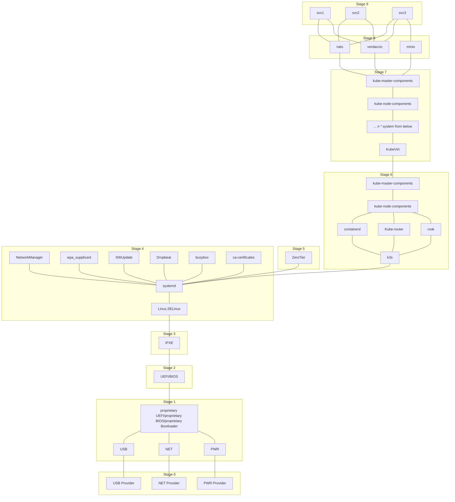
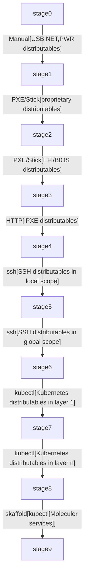
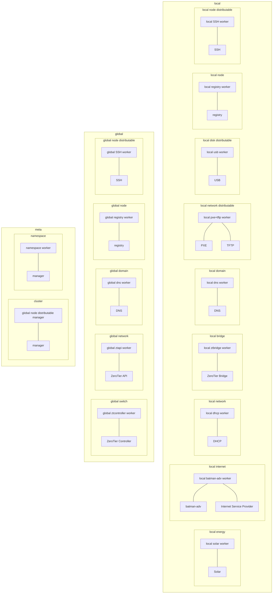
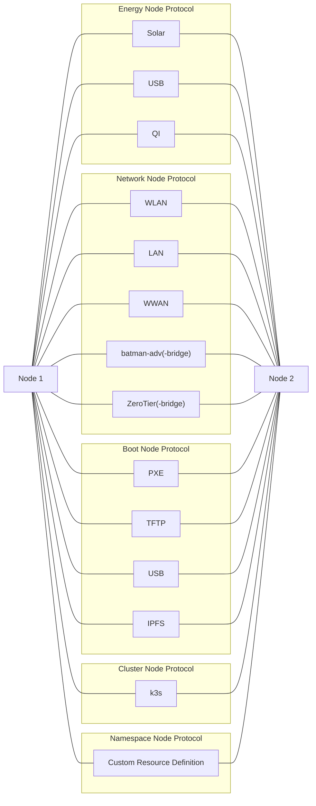

# Single Diagram Cluster Platform

## States

## Steps

> These are just some examples. You may of course use different means of distributing the states, skip steps, ...

## Means

### Imperative

### Declarative

