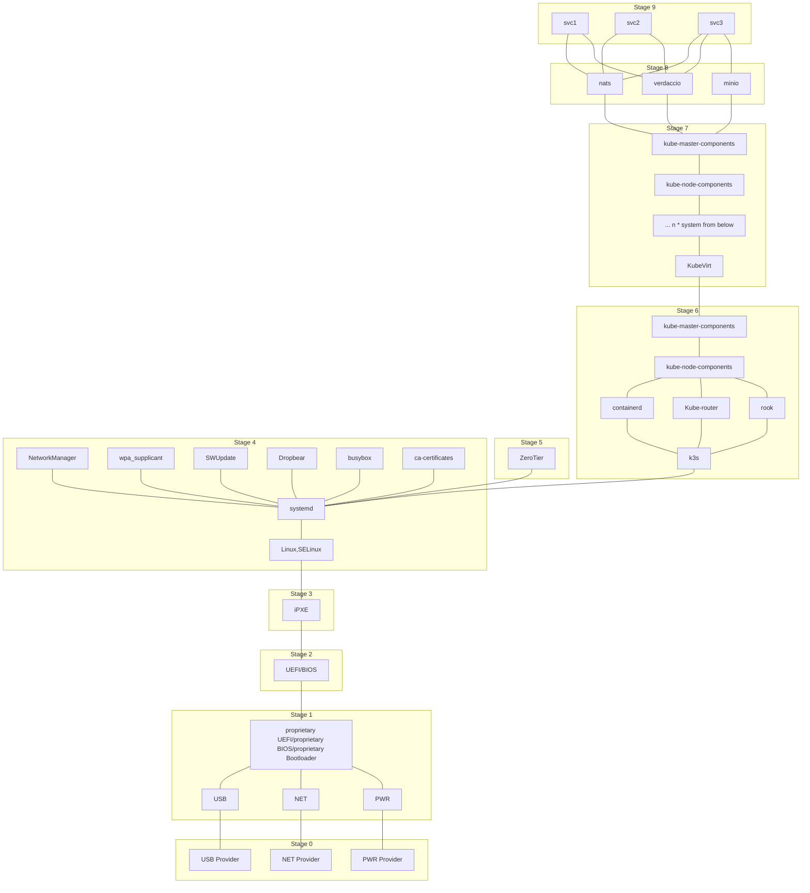
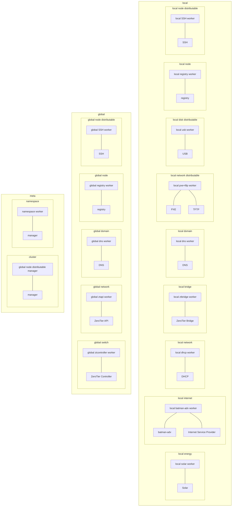
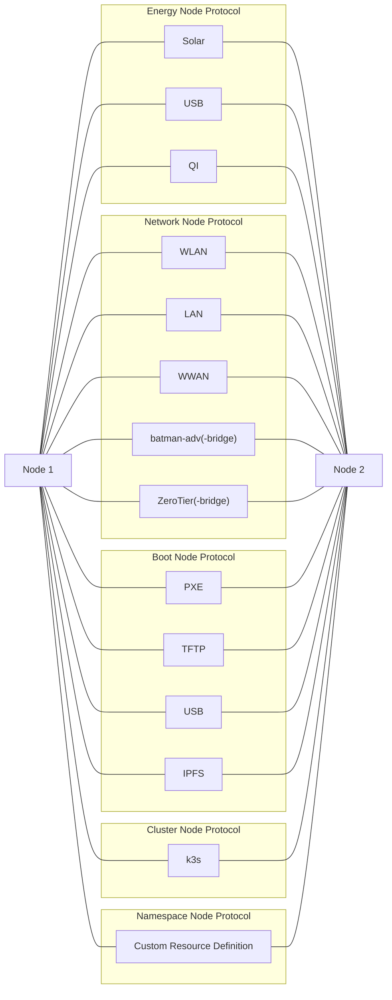

# Single Diagram Cluster Platform

## States

## Steps

> This is just an example. You may of course use different means of distributing the states, skip steps, ...

```mermaid
graph TB
    state0[State 0]
    subgraph Step 0
        humanmanager[Human manager]
        humanworker[Human worker]
        hand[Hand]
        handdistributable[Hand distributable with USB,NET,PWR]
        humanmanager --> humanworker
        humanworker --> hand
        hand --> handdistributable
    end
    handdistributable --> state0
    state1[State 1]
    state0 --> state1
    subgraph Step 1
        dhcpmanager[DHCP manager]
        dhcpworker[DHCP worker]
        dhcp[DHCP]
        dnsmanager[DNS manager]
        dnsworker[DNS worker]
        dns[DNS]
        pxemanager[PXE manager]
        pxeworker[PXE worker]
        pxe[PXE]
        tftpmanager[TFTP manager]
        tftpworker[TFTP worker]
        tftp[TFTP]
        proprietarylocalnetworkdistributable[Proprietary network distributable in local scope with BIOS/UEFI]
        humanmanager1[Human manager]
        humanworker1[Human worker]
        stick[Stick]
        proprietarymediadistributable[Proprietary media distributable]
        dhcpmanager --> dhcpworker
        dhcpworker --> dhcp
        dnsmanager --> dnsworker
        dnsworker --> dns
        dhcp --> dns
        pxemanager --> pxeworker
        pxeworker --> pxe
        dns --> pxe
        tftpmanager --> tftpworker
        tftpworker --> tftp
        pxe --> tftp
        tftp --> proprietarylocalnetworkdistributable
        humanmanager1 --> humanworker1
        humanworker1 --> stick
        stick --> proprietarymediadistributable
    end
    proprietarylocalnetworkdistributable --> state1
    proprietarymediadistributable --> state1
    state2[State 2]
    state1 --> state2
    subgraph Step 2
        tftp --> uefibioslocalnetworkdistributable
        uefibioslocalnetworkdistributable[UEFI/BIOS network distributable in local scope with iPXE]
        uefibiosmediadistributable[UEFI/BIOS media distributable]
        stick --> uefibiosmediadistributable
    end
    uefibioslocalnetworkdistributable --> state2
    uefibiosmediadistributable --> state2
    state3[State 3]
    state2 --> state3
    subgraph Step 3
        scriptrepo[script repository]
        ipxescript[iPXE script]
        http31[HTTP]
        kernelrepo[Kernel repository]
        kernel[Kernel]
        http32[HTTP]
        initramfsrepo[Inital RAM filesystem repo]
        initramfs[Inital RAM filesystem]
        http33[HTTP]
        osrepomirrorrepo[OS repo mirror repository]
        osrepomirror[OS repo mirror]
        http34[HTTP]
        kickstart[Kickstart]
        http35[HTTP]
        prescript[pre-reboot script]
        http36[HTTP]
        postscript[post-reboot script]
        http37[HTTP]
        sshkeymanager[SSH key manager]
        sshkeyworker[SSH key worker]
        http38[HTTP]
        sshkey[SSH key]
        http39[HTTP]
        globalnetworkdistributable[network distributable in global scope with generic GNU/Linux distro]
        scriptrepo --> ipxescript
        ipxescript --> http31
        http31 --> globalnetworkdistributable
        kernelrepo --> kernel
        kernel --> http32
        http32 --> globalnetworkdistributable
        initramfsrepo --> initramfs
        initramfs --> http33
        http33 --> globalnetworkdistributable
        osrepomirrorrepo --> osrepomirror
        osrepomirror --> http34
        http34 --> globalnetworkdistributable
        scriptrepo --> kickstart
        kickstart --> http35
        http35 --> globalnetworkdistributable
        scriptrepo --> prescript
        prescript --> http36
        http36 --> kickstart
        scriptrepo --> http37
        http37 --> postscript
        postscript --> http38
        http38 --> kickstart
        sshkeymanager --> sshkeyworker
        sshkeyworker --> sshkey
        sshkey --> http39
        http39 --> postscript
    end
    globalnetworkdistributable --> state3
    state4[State 4]
    state3 --> state4
    subgraph Step 4
        sshdistributablemanager[Remote shell distributable manager]
        localsshdistributableworker[Remote shell distributable worker in local scope]
        ssh4[SSH]
        localregistry[local registry]
        sshdistributable4[remote shell distributable with ZeroTier VPN]
        sshdistributablemanager --> localsshdistributableworker
        localsshdistributableworker --> ssh4
        ssh4 --> sshdistributable4
        localregistry --> sshdistributable4
    end
    sshdistributable4 --> state4
    state5[State 5]
    state4 --> state5
    subgraph Step 5
        globalsshdistributableworker[Remote shell distributable worker in global scope]
        ssh5[SSH]
        globalregistry[global registry]
        sshdistributable5[remote shell distributable with k3s]
        sshdistributablemanager --> globalsshdistributableworker
        globalsshdistributableworker --> ssh5
        ssh5 --> sshdistributable5
        globalregistry --> sshdistributable5
    end
    sshdistributable5 --> state5
    state6[State 6]
    state5 --> state6
    subgraph Step 6
        clusterdistributablemanager[cluster distributable manager]
        clusterdistributableworker[cluster distributable worker]
        kubectl[kubectl]
        clusterdistributablelayer1[cluster distributable in layer 1 with KubeVirt]
        clusterdistributablemanager --> clusterdistributableworker
        clusterdistributableworker --> kubectl
        kubectl --> clusterdistributablelayer1
    end
    clusterdistributablelayer1 --> state6
    state7[State 7]
    state6 --> state7
    subgraph Step 7
        kubectl --> clusterdistributablelayern
        clusterdistributablelayern[cluster distributable in layer n with dependencies]
    end
    clusterdistributablelayern --> state7
    state8[State 8]
    state7 --> state8
    subgraph Step 8
        skaffold[Skaffold]
        kubectl8[kubectl]
        servicemeshdistributable[service mesh distributable with services]
        skaffold --> kubectl8
        kubectl8 --> servicemeshdistributable
    end
    servicemeshdistributable --> state8
    state9[State 9]
    state8 --> state9
```

## Means

### Imperative

### Declarative

