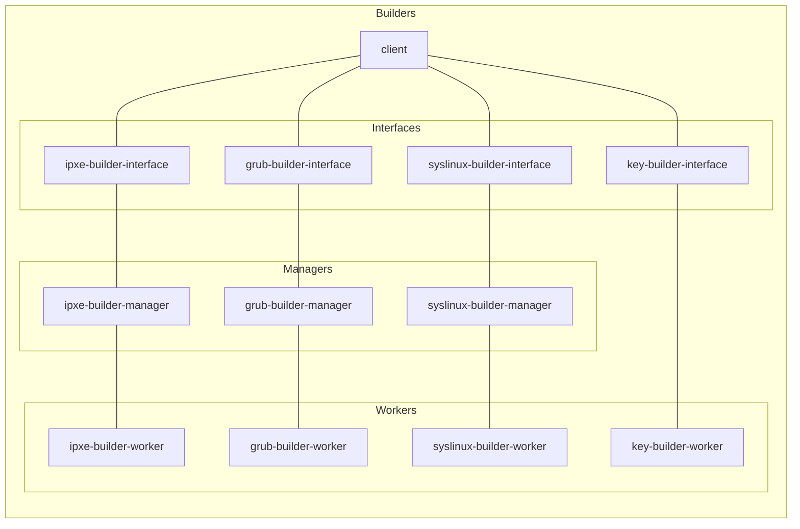
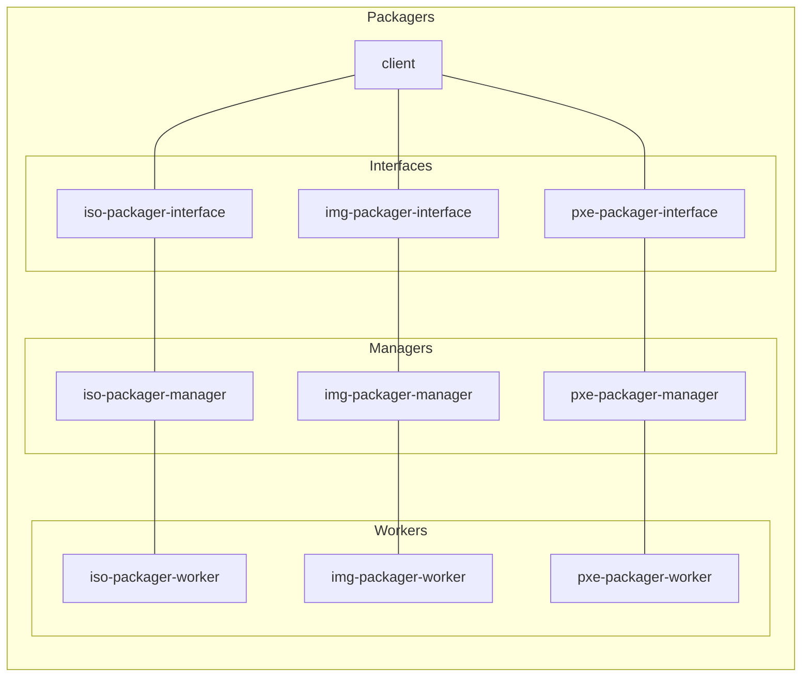
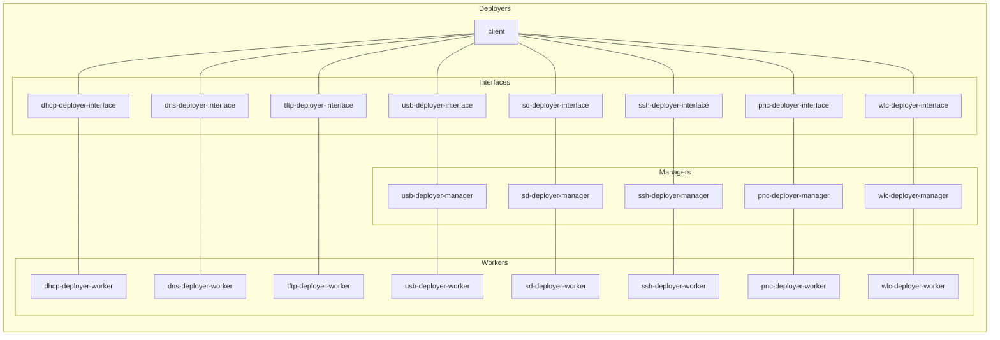
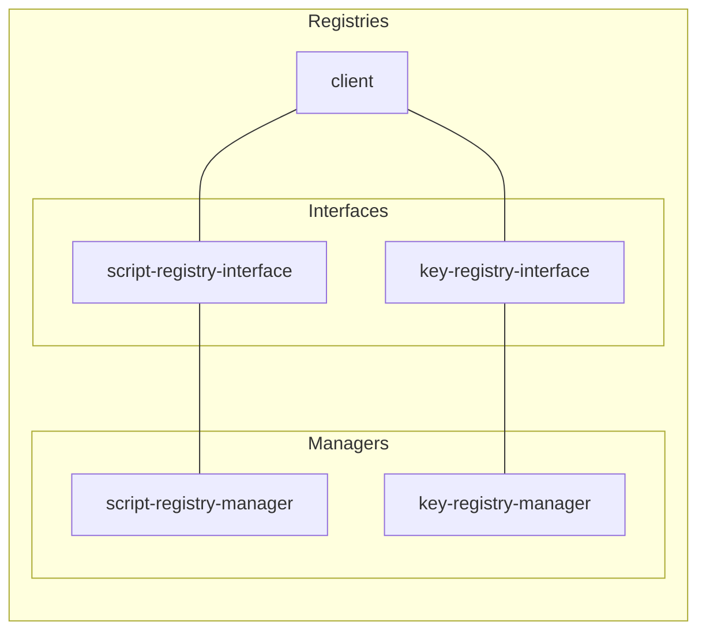

# Cluster Platform New Architecture Overview

```mermaid
graph LR
    subgraph Builders
        client

        subgraph Interfaces
            ipxe-builder-interface
            grub-builder-interface
            syslinux-builder-interface
            key-builder-interface
        end

        subgraph Managers
            ipxe-builder-manager
            grub-builder-manager
            syslinux-builder-manager
        end

        subgraph Workers
            ipxe-builder-worker
            grub-builder-worker
            syslinux-builder-worker
            key-builder-worker
        end

        client --- ipxe-builder-interface
        client --- grub-builder-interface
        client --- syslinux-builder-interface
        client --- key-builder-interface

        ipxe-builder-interface --- ipxe-builder-manager
        ipxe-builder-manager --- ipxe-builder-worker

        grub-builder-interface --- grub-builder-manager
        grub-builder-manager --- grub-builder-worker

        syslinux-builder-interface --- syslinux-builder-manager
        syslinux-builder-manager --- syslinux-builder-worker

        key-builder-interface --- key-builder-worker
    end
```

```mermaid
graph LR
    subgraph Packagers
        client

        subgraph Interfaces
            iso-packager-interface
            img-packager-interface
            pxe-packager-interface
        end

        subgraph Managers
            iso-packager-manager
            img-packager-manager
            pxe-packager-manager
        end

        subgraph Workers
            iso-packager-worker
            img-packager-worker
            pxe-packager-worker
        end

        client --- iso-packager-interface
        client --- img-packager-interface
        client --- pxe-packager-interface

        iso-packager-interface --- iso-packager-manager
        iso-packager-manager --- iso-packager-worker

        img-packager-interface --- img-packager-manager
        img-packager-manager --- img-packager-worker

        pxe-packager-interface --- pxe-packager-manager
        pxe-packager-manager --- pxe-packager-worker
    end
```

```mermaid
graph LR
    subgraph Deployers
        client

        subgraph Interfaces
            dhcp-deployer-interface
            dns-deployer-interface
            usb-deployer-interface
            sd-deployer-interface
            tftp-deployer-interface
            ssh-deployer-interface
            pnc-deployer-interface
            wlc-deployer-interface
        end

        subgraph Managers
            usb-deployer-manager
            sd-deployer-manager
            ssh-deployer-manager
            pnc-deployer-manager
            wlc-deployer-manager
        end

        subgraph Workers
            dhcp-deployer-worker
            dns-deployer-worker
            tftp-deployer-worker
            usb-deployer-worker
            sd-deployer-worker
            ssh-deployer-worker
            pnc-deployer-worker
            wlc-deployer-worker
        end

        client --- dhcp-deployer-interface
        client --- dns-deployer-interface
        client --- usb-deployer-interface
        client --- sd-deployer-interface
        client --- tftp-deployer-interface
        client --- ssh-deployer-interface
        client --- pnc-deployer-interface
        client --- wlc-deployer-interface

        dhcp-deployer-interface --- dhcp-deployer-worker

        dns-deployer-interface --- dns-deployer-worker

        tftp-deployer-interface --- tftp-deployer-worker

        usb-deployer-interface --- usb-deployer-manager
        usb-deployer-manager --- usb-deployer-worker

        sd-deployer-interface --- sd-deployer-manager
        sd-deployer-manager --- sd-deployer-worker

        ssh-deployer-interface --- ssh-deployer-manager
        ssh-deployer-manager --- ssh-deployer-worker

        pnc-deployer-interface --- pnc-deployer-manager
        pnc-deployer-manager --- pnc-deployer-worker

        wlc-deployer-interface --- wlc-deployer-manager
        wlc-deployer-manager --- wlc-deployer-worker
    end
```

```mermaid
graph LR
    subgraph Registries
        client

        subgraph Interfaces
            script-registry-interface
            key-registry-interface
        end

        subgraph Managers
            script-registry-manager
            key-registry-manager
        end

        client --- script-registry-interface
        client --- key-registry-interface

        script-registry-interface --- script-registry-manager
        key-registry-interface --- key-registry-manager
    end
```
