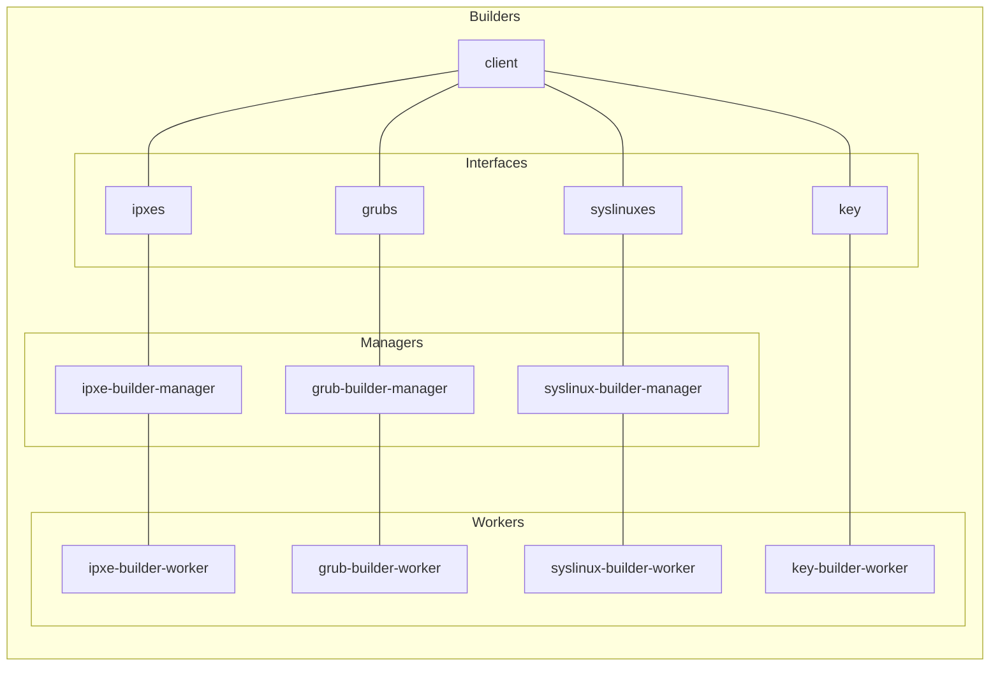
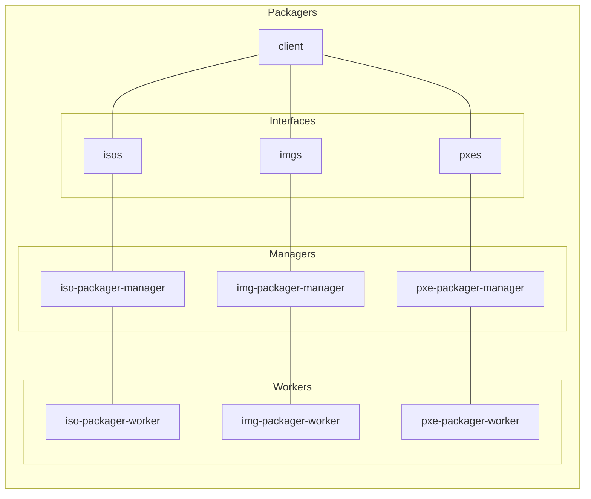
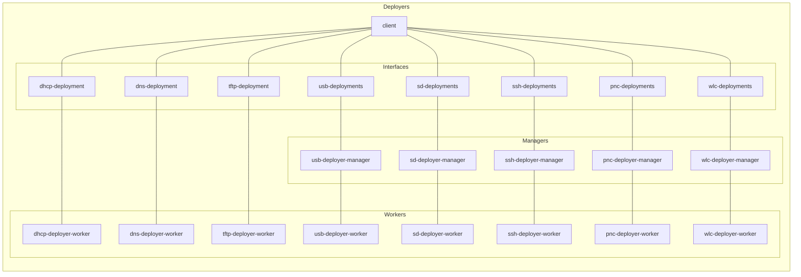
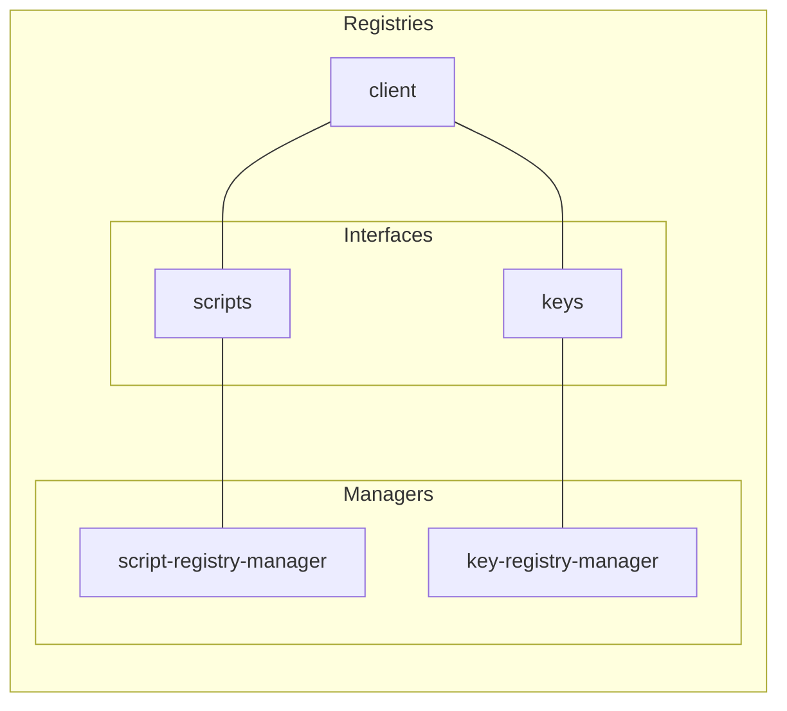

# Cluster Platform New Architecture Overview

Note: No S3 buckets, databases, network interfaces etc. are shown because they are to be set by the client as a parameter or an environment variable!

## Builders

## Packagers

## Deployers

## Registries

